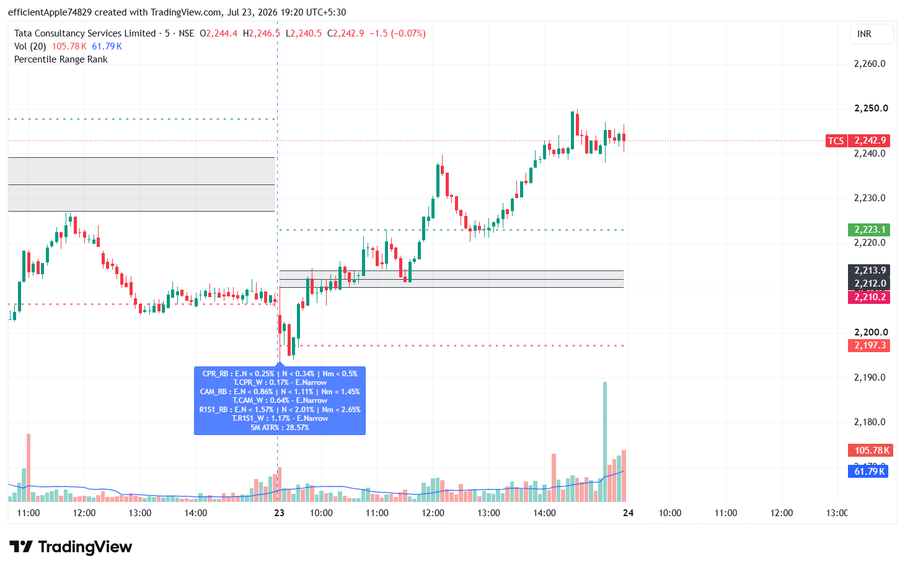
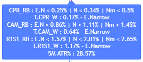
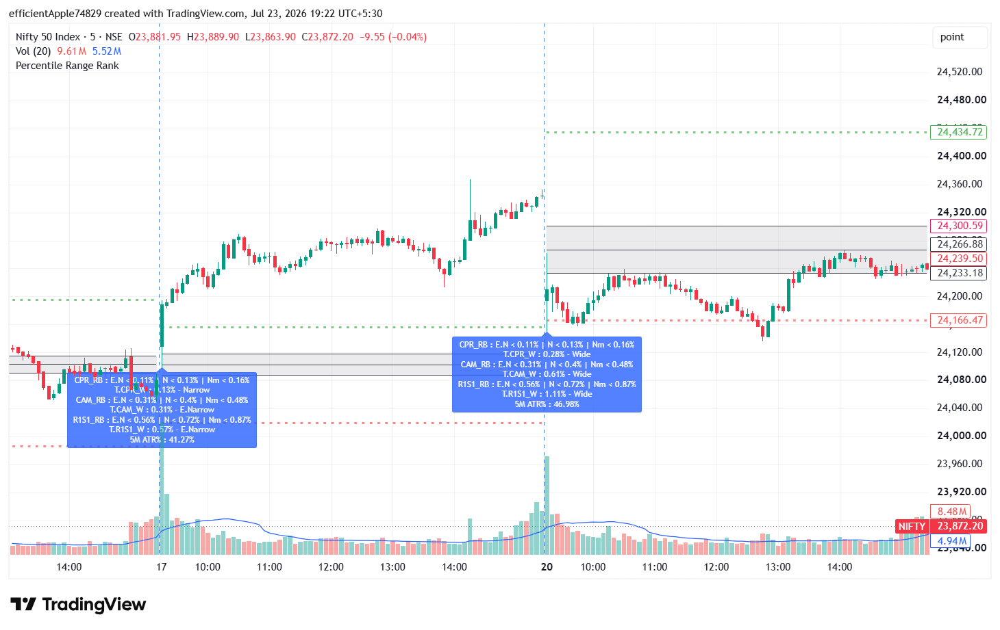

# Percentile Range Rank

A TradingView Pine Script indicator that uses 30-day percentile ranking of CPR, Camarilla, and R1/S1 widths to classify market range conditions and volatility context.

## Overview

This indicator helps analyze the current day's structural range by comparing key pivot-based widths against their 30-day historical percentile distribution.

It calculates and classifies:
- CPR width
- Camarilla width
- R1/S1 width
- First 5-minute range as a percentage of yesterday's 14-day ATR

## Features

- Daily CPR calculation using previous day's OHLC.
- 30-day percentile ranking for CPR width.
- 30-day percentile ranking for Camarilla width.
- 30-day percentile ranking for R1/S1 width.
- Range classification into E.Narrow, Narrow, Normal, and Wide.
- Visual plotting of CPR zone, pivot levels, R1, and S1.
- First 5-minute ATR percentage display for intraday context.

## Screenshots

### Chart Overview
Shows the CPR zone, pivot levels, R1, and S1 on the chart.

### Label Output
Shows the percentile ranking label with band classification and ATR context.

### Range Classification
Shows another market example with different range conditions.

## How it works

The script:
1. Pulls previous daily OHLC values.
2. Computes CPR, Camarilla, and R1/S1 levels.
3. Converts their widths into percentages.
4. Compares current values against a 30-day historical lookback using percentile ranking.
5. Displays the current day's classification directly on the chart.

## Technical Approach

- Algorithmic thinking.
- Data analysis and transformation.
- Time-series calculations.
- Financial market logic.
- Real-time visualization.

## Usage

1. Open TradingView.
2. Open Pine Editor.
3. Copy the script from `percentile-range-rank.pine`.
4. Paste it into Pine Editor.
5. Add the indicator to your chart.

## File

- `percentile-range-rank.pine` — main indicator source code

## Notes

This script is intended for educational and analytical purposes. It does not provide financial advice or guaranteed trading signals.

## License

This project is licensed under the MIT License.
